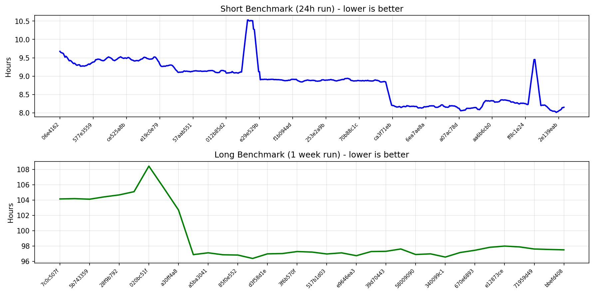

# nimbus-eth1-benchmarks

This repository contains various eth1 import benchmark metrics.

## Performance Trend

## Latest 5 Short Benchmarks (24 Hour Run)

[View full history](./short-benchmark-history.csv)

| Generated At | Baseline SHA | Contender SHA | Baseline Time | Contender Time | Time Delta |
|--------------|--------------|---------------|---------------|----------------|------------|
| 2026-01-10 03:34:23 | [da507bd9](https://github.com/status-im/nimbus-eth1/commit/da507bd9) | [bd09787d](https://github.com/status-im/nimbus-eth1/commit/bd09787d) | 8h10m5s | 8h10m14s | 9s, 0.03% |
| 2026-01-09 19:11:01 | [e8f46e56](https://github.com/status-im/nimbus-eth1/commit/e8f46e56) | [da507bd9](https://github.com/status-im/nimbus-eth1/commit/da507bd9) | 8h11m25s | 8h10m5s | -1m20s, -0.27% |
| 2026-01-09 10:46:22 | [7d71cfef](https://github.com/status-im/nimbus-eth1/commit/7d71cfef) | [e8f46e56](https://github.com/status-im/nimbus-eth1/commit/e8f46e56) | 8h10m25s | 8h11m25s | 1m0s, 0.20% |
| 2026-01-09 02:22:43 | [ca58ca62](https://github.com/status-im/nimbus-eth1/commit/ca58ca62) | [7d71cfef](https://github.com/status-im/nimbus-eth1/commit/7d71cfef) | 8h11m46s | 8h10m25s | -1m21s, -0.27% |
| 2026-01-08 17:57:36 | [e449b1f5](https://github.com/status-im/nimbus-eth1/commit/e449b1f5) | [ca58ca62](https://github.com/status-im/nimbus-eth1/commit/ca58ca62) | 8h11m57s | 8h11m46s | -11s, -0.04% |

## Latest 5 Long Benchmarks (1 Week Run)

[View full history](./long-benchmark-history.csv)

| Generated At | Baseline SHA | Contender SHA | Baseline Time | Contender Time | Time Delta |
|--------------|--------------|---------------|---------------|----------------|------------|
| 2025-12-16 04:06:31 | [e12873ce](https://github.com/status-im/nimbus-eth1/commit/e12873ce) | [ee411adc](https://github.com/status-im/nimbus-eth1/commit/ee411adc) | 97h13m44s | 98h12m19s | 58m35s, 1.00% |
| 2025-12-12 02:42:40 | [ee411adc](https://github.com/status-im/nimbus-eth1/commit/ee411adc) | [e12873ce](https://github.com/status-im/nimbus-eth1/commit/e12873ce) | 98h30m28s | 97h13m44s | -1h16m44s, -1.30% |
| 2025-12-08 00:02:01 | [e12873ce](https://github.com/status-im/nimbus-eth1/commit/e12873ce) | [cbc93369](https://github.com/status-im/nimbus-eth1/commit/cbc93369) | 97h43m58s | 98h30m28s | 46m30s, 0.79% |
| 2025-12-03 22:07:55 | [cbc93369](https://github.com/status-im/nimbus-eth1/commit/cbc93369) | [670e6893](https://github.com/status-im/nimbus-eth1/commit/670e6893) | 96h3m33s | 97h43m58s | 1h40m25s, 1.74% |
| 2025-11-29 21:54:13 | [670e6893](https://github.com/status-im/nimbus-eth1/commit/670e6893) | [230e18fc](https://github.com/status-im/nimbus-eth1/commit/230e18fc) | 97h37m40s | 96h3m33s | -1h34m7s, -1.61% |

## Regressions

Commits with performance regressions greater than 1% (slower), sorted by severity. [View full data](./regressions.csv)

| Generated At | Baseline SHA | Contender SHA | Baseline Time | Contender Time | Time Delta |
|--------------|--------------|---------------|---------------|----------------|------------|
| 2025-07-18 02:43:34 | [5b798fe11](https://github.com/status-im/nimbus-eth1/commit/5b798fe11) | [6ec7ab001](https://github.com/status-im/nimbus-eth1/commit/6ec7ab001) | 8h56m32s | 10h24m13s | 1h27m41s, 16.34% |
| 2025-07-11 15:17:08 | [341384792](https://github.com/status-im/nimbus-eth1/commit/341384792) | [3a009158d](https://github.com/status-im/nimbus-eth1/commit/3a009158d) | 9h7m46s | 10h29m15s | 1h21m28s, 14.87% |
| 2024-12-16 02:40:07 | [0ce52342](https://github.com/status-im/nimbus-eth1/commit/0ce52342) | [650fec5a](https://github.com/status-im/nimbus-eth1/commit/650fec5a) | 9h14m36s | 9h34m44s | 20m8s, 3.63% |
| 2025-02-11 14:01:09 | [02014b38](https://github.com/status-im/nimbus-eth1/commit/02014b38) | [577e3559](https://github.com/status-im/nimbus-eth1/commit/577e3559) | 9h10m25s | 9h27m56s | 17m31s, 3.18% |
| 2026-01-05 14:13:53 | [f3253f49](https://github.com/status-im/nimbus-eth1/commit/f3253f49) | [406115ac](https://github.com/status-im/nimbus-eth1/commit/406115ac) | 8h1m16s | 8h13m10s | 11m54s, 2.47% |
| 2024-12-28 09:07:49 | [7c0c507f](https://github.com/status-im/nimbus-eth1/commit/7c0c507f) | [5182a086](https://github.com/status-im/nimbus-eth1/commit/5182a086) | 9h17m19s | 9h29m48s | 12m28s, 2.24% |
| 2025-05-29 11:09:39 | [af07a5366](https://github.com/status-im/nimbus-eth1/commit/af07a5366) | [0c877f200](https://github.com/status-im/nimbus-eth1/commit/0c877f200) | 9h7m18s | 9h18m53s | 11m35s, 2.12% |
| 2025-04-05 04:47:48 | [4fee105b8](https://github.com/status-im/nimbus-eth1/commit/4fee105b8) | [9c9f9d416](https://github.com/status-im/nimbus-eth1/commit/9c9f9d416) | 9h28m25s | 9h40m0s | 11m34s, 2.04% |
| 2025-09-28 02:34:34 | [b5a92553](https://github.com/status-im/nimbus-eth1/commit/b5a92553) | [8413e387](https://github.com/status-im/nimbus-eth1/commit/8413e387) | 8h54m56s | 9h4m52s | 9m56s, 1.86% |
| 2025-03-26 15:16:31 | [9244cc9a3](https://github.com/status-im/nimbus-eth1/commit/9244cc9a3) | [8a64c5950](https://github.com/status-im/nimbus-eth1/commit/8a64c5950) | 9h22m56s | 9h33m2s | 10m6s, 1.79% |
| 2025-07-12 02:17:28 | [60e98921b](https://github.com/status-im/nimbus-eth1/commit/60e98921b) | [341384792](https://github.com/status-im/nimbus-eth1/commit/341384792) | 10h29m15s | 10h40m27s | 11m11s, 1.78% |
| 2025-06-11 05:26:42 | [6ce4568e6](https://github.com/status-im/nimbus-eth1/commit/6ce4568e6) | [64d14b3c7](https://github.com/status-im/nimbus-eth1/commit/64d14b3c7) | 8h57m11s | 9h6m22s | 9m10s, 1.71% |
| 2025-10-10 23:56:21 | [0d1ae01a](https://github.com/status-im/nimbus-eth1/commit/0d1ae01a) | [348425a5](https://github.com/status-im/nimbus-eth1/commit/348425a5) | 8h50m42s | 8h59m20s | 8m38s, 1.63% |
| 2025-04-29 07:08:56 | [91850aa8d](https://github.com/status-im/nimbus-eth1/commit/91850aa8d) | [04d44e2de](https://github.com/status-im/nimbus-eth1/commit/04d44e2de) | 9h0m4s | 9h8m23s | 8m18s, 1.54% |
| 2025-02-07 02:34:43 | [daebbfa1](https://github.com/status-im/nimbus-eth1/commit/daebbfa1) | [796c2f7c](https://github.com/status-im/nimbus-eth1/commit/796c2f7c) | 9h15m34s | 9h23m40s | 8m6s, 1.46% |
| 2026-01-06 07:03:31 | [c030b05d](https://github.com/status-im/nimbus-eth1/commit/c030b05d) | [d779031a](https://github.com/status-im/nimbus-eth1/commit/d779031a) | 8h10m57s | 8h17m48s | 6m50s, 1.39% |
| 2025-09-15 13:51:18 | [69cc793c](https://github.com/status-im/nimbus-eth1/commit/69cc793c) | [43762789](https://github.com/status-im/nimbus-eth1/commit/43762789) | 8h45m32s | 8h52m48s | 7m15s, 1.38% |
| 2025-05-27 03:12:11 | [d40f487c0](https://github.com/status-im/nimbus-eth1/commit/d40f487c0) | [aff4b93a5](https://github.com/status-im/nimbus-eth1/commit/aff4b93a5) | 8h58m32s | 9h5m49s | 7m16s, 1.35% |
| 2025-03-04 13:13:30 | [e68a532b](https://github.com/status-im/nimbus-eth1/commit/e68a532b) | [b913e233](https://github.com/status-im/nimbus-eth1/commit/b913e233) | 9h20m37s | 9h28m1s | 7m24s, 1.32% |
| 2026-01-03 20:18:17 | [fe3abfe4](https://github.com/status-im/nimbus-eth1/commit/fe3abfe4) | [fe162f00](https://github.com/status-im/nimbus-eth1/commit/fe162f00) | 8h6m44s | 8h13m8s | 6m24s, 1.31% |
| 2025-07-07 15:52:14 | [8a5825f82](https://github.com/status-im/nimbus-eth1/commit/8a5825f82) | [90892ddea](https://github.com/status-im/nimbus-eth1/commit/90892ddea) | 8h57m22s | 9h3m55s | 6m32s, 1.22% |
| 2025-02-14 20:34:17 | [b6584153](https://github.com/status-im/nimbus-eth1/commit/b6584153) | [42bb6404](https://github.com/status-im/nimbus-eth1/commit/42bb6404) | 9h24m46s | 9h31m28s | 6m41s, 1.19% |

## Improvements

Commits with performance improvements greater than 1% (faster), sorted by magnitude. [View full data](./improvements.csv)

| Generated At | Baseline SHA | Contender SHA | Baseline Time | Contender Time | Time Delta |
|--------------|--------------|---------------|---------------|----------------|------------|
| 2025-07-17 11:36:15 | [6ec7ab001](https://github.com/status-im/nimbus-eth1/commit/6ec7ab001) | [13fe6bffe](https://github.com/status-im/nimbus-eth1/commit/13fe6bffe) | 10h30m54s | 8h56m32s | -1h34m22s, -14.96% |
| 2025-07-18 11:58:41 | [2d8b7501e](https://github.com/status-im/nimbus-eth1/commit/2d8b7501e) | [5b798fe11](https://github.com/status-im/nimbus-eth1/commit/5b798fe11) | 10h24m13s | 8h55m53s | -1h28m19s, -14.15% |
| 2025-10-16 16:05:06 | [d5c4af24](https://github.com/status-im/nimbus-eth1/commit/d5c4af24) | [552755a9](https://github.com/status-im/nimbus-eth1/commit/552755a9) | 8h48m35s | 8h12m14s | -36m21s, -6.88% |
| 2025-08-13 15:57:04 | [a48162c2](https://github.com/status-im/nimbus-eth1/commit/a48162c2) | [2ea90ab0](https://github.com/status-im/nimbus-eth1/commit/2ea90ab0) | 9h28m53s | 8h55m48s | -33m5s, -5.82% |
| 2024-12-12 22:06:30 | [650fec5a](https://github.com/status-im/nimbus-eth1/commit/650fec5a) | [674e65f3](https://github.com/status-im/nimbus-eth1/commit/674e65f3) | 9h46m14s | 9h14m36s | -31m37s, -5.39% |
| 2025-07-23 00:16:18 | [deb11b56a](https://github.com/status-im/nimbus-eth1/commit/deb11b56a) | [969db723e](https://github.com/status-im/nimbus-eth1/commit/969db723e) | 9h22m0s | 8h53m8s | -28m52s, -5.14% |
| 2025-08-11 05:57:43 | [5286def0](https://github.com/status-im/nimbus-eth1/commit/5286def0) | [71959d49](https://github.com/status-im/nimbus-eth1/commit/71959d49) | 9h17m23s | 8h51m48s | -25m34s, -4.59% |
| 2024-12-18 23:50:21 | [48aa410f](https://github.com/status-im/nimbus-eth1/commit/48aa410f) | [7bbb0f44](https://github.com/status-im/nimbus-eth1/commit/7bbb0f44) | 9h39m26s | 9h22m27s | -16m58s, -2.93% |
| 2025-02-10 12:17:31 | [577e3559](https://github.com/status-im/nimbus-eth1/commit/577e3559) | [f033a404](https://github.com/status-im/nimbus-eth1/commit/f033a404) | 9h22m40s | 9h10m25s | -12m15s, -2.18% |
| 2024-12-29 15:39:34 | [fc9077b1](https://github.com/status-im/nimbus-eth1/commit/fc9077b1) | [7c0c507f](https://github.com/status-im/nimbus-eth1/commit/7c0c507f) | 9h29m48s | 9h17m26s | -12m21s, -2.17% |
| 2025-06-03 00:26:00 | [f5db4e4b5](https://github.com/status-im/nimbus-eth1/commit/f5db4e4b5) | [af07a5366](https://github.com/status-im/nimbus-eth1/commit/af07a5366) | 9h18m53s | 9h7m15s | -11m38s, -2.08% |
| 2025-06-16 17:40:08 | [90892ddea](https://github.com/status-im/nimbus-eth1/commit/90892ddea) | [3c572c49b](https://github.com/status-im/nimbus-eth1/commit/3c572c49b) | 9h8m14s | 8h57m22s | -10m52s, -1.98% |
| 2025-06-10 20:07:28 | [64d14b3c7](https://github.com/status-im/nimbus-eth1/commit/64d14b3c7) | [0ef2e8c98](https://github.com/status-im/nimbus-eth1/commit/0ef2e8c98) | 9h7m37s | 8h57m11s | -10m25s, -1.90% |
| 2025-09-28 11:52:48 | [d7c6812a](https://github.com/status-im/nimbus-eth1/commit/d7c6812a) | [b5a92553](https://github.com/status-im/nimbus-eth1/commit/b5a92553) | 9h4m52s | 8h54m36s | -10m16s, -1.89% |
| 2025-04-09 04:38:13 | [e19c0e79c](https://github.com/status-im/nimbus-eth1/commit/e19c0e79c) | [a1653e755](https://github.com/status-im/nimbus-eth1/commit/a1653e755) | 9h26m50s | 9h17m23s | -9m26s, -1.67% |
| 2025-04-28 21:25:53 | [04d44e2de](https://github.com/status-im/nimbus-eth1/commit/04d44e2de) | [8ba706529](https://github.com/status-im/nimbus-eth1/commit/8ba706529) | 9h8m50s | 9h0m4s | -8m46s, -1.60% |
| 2025-07-12 13:07:17 | [a7d5ff3ea](https://github.com/status-im/nimbus-eth1/commit/a7d5ff3ea) | [60e98921b](https://github.com/status-im/nimbus-eth1/commit/60e98921b) | 10h40m27s | 10h30m12s | -10m14s, -1.60% |
| 2026-01-04 21:39:51 | [109e4a63](https://github.com/status-im/nimbus-eth1/commit/109e4a63) | [1d945822](https://github.com/status-im/nimbus-eth1/commit/1d945822) | 8h13m40s | 8h5m56s | -7m44s, -1.57% |
| 2025-04-08 09:29:07 | [408406aca](https://github.com/status-im/nimbus-eth1/commit/408406aca) | [4fee105b8](https://github.com/status-im/nimbus-eth1/commit/4fee105b8) | 9h40m0s | 9h31m6s | -8m54s, -1.54% |
| 2026-01-06 15:34:42 | [d779031a](https://github.com/status-im/nimbus-eth1/commit/d779031a) | [5503a3cc](https://github.com/status-im/nimbus-eth1/commit/5503a3cc) | 8h17m48s | 8h10m21s | -7m26s, -1.50% |
| 2025-03-10 13:39:39 | [b6feaf19](https://github.com/status-im/nimbus-eth1/commit/b6feaf19) | [3fda3433](https://github.com/status-im/nimbus-eth1/commit/3fda3433) | 9h33m17s | 9h24m56s | -8m21s, -1.46% |
| 2025-04-24 05:43:29 | [24d1dcf46](https://github.com/status-im/nimbus-eth1/commit/24d1dcf46) | [bcff15e1c](https://github.com/status-im/nimbus-eth1/commit/bcff15e1c) | 9h13m39s | 9h5m56s | -7m42s, -1.39% |
| 2025-05-26 17:55:15 | [aff4b93a5](https://github.com/status-im/nimbus-eth1/commit/aff4b93a5) | [20cd0c92e](https://github.com/status-im/nimbus-eth1/commit/20cd0c92e) | 9h5m56s | 8h58m32s | -7m23s, -1.36% |
| 2025-03-16 14:11:03 | [44db666c9](https://github.com/status-im/nimbus-eth1/commit/44db666c9) | [f7fd8c2af](https://github.com/status-im/nimbus-eth1/commit/f7fd8c2af) | 9h31m59s | 9h24m54s | -7m4s, -1.24% |
| 2025-05-05 03:54:46 | [60f3d3db0](https://github.com/status-im/nimbus-eth1/commit/60f3d3db0) | [80b0fbfb6](https://github.com/status-im/nimbus-eth1/commit/80b0fbfb6) | 9h11m18s | 9h4m57s | -6m20s, -1.15% |
| 2025-09-15 04:53:52 | [43762789](https://github.com/status-im/nimbus-eth1/commit/43762789) | [a7ac8031](https://github.com/status-im/nimbus-eth1/commit/a7ac8031) | 8h51m40s | 8h45m32s | -6m7s, -1.15% |
| 2024-12-22 23:30:00 | [aeec74e3](https://github.com/status-im/nimbus-eth1/commit/aeec74e3) | [487743fc](https://github.com/status-im/nimbus-eth1/commit/487743fc) | 9h26m32s | 9h20m22s | -6m10s, -1.09% |
| 2025-10-08 17:27:31 | [80ddb54c](https://github.com/status-im/nimbus-eth1/commit/80ddb54c) | [1ec00066](https://github.com/status-im/nimbus-eth1/commit/1ec00066) | 8h55m44s | 8h49m55s | -5m48s, -1.09% |
| 2025-02-28 23:17:00 | [019b8e3a](https://github.com/status-im/nimbus-eth1/commit/019b8e3a) | [45767278](https://github.com/status-im/nimbus-eth1/commit/45767278) | 9h31m0s | 9h24m56s | -6m4s, -1.06% |
| 2025-09-06 20:59:56 | [1ae79dc6](https://github.com/status-im/nimbus-eth1/commit/1ae79dc6) | [14034703](https://github.com/status-im/nimbus-eth1/commit/14034703) | 8h55m18s | 8h49m42s | -5m36s, -1.05% |
| 2025-10-12 03:25:34 | [8ee3285d](https://github.com/status-im/nimbus-eth1/commit/8ee3285d) | [59aad34c](https://github.com/status-im/nimbus-eth1/commit/59aad34c) | 8h53m22s | 8h47m57s | -5m25s, -1.02% |
